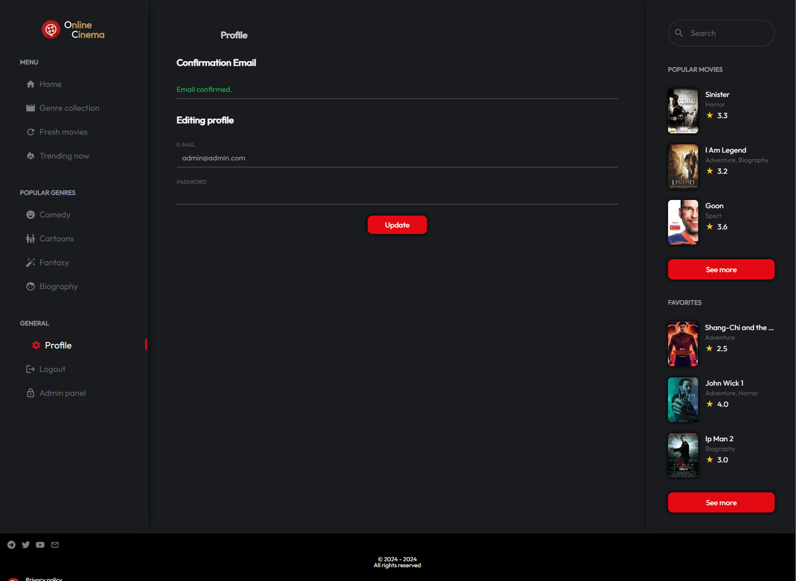

# «Online-cinema» | Fully functional online cinema

[Deploy link](https://cinema-private.ru)

Preview:

## _Implementation features:_

---

The application is adapted for all types of mobile and desktop devices.

Implemented front-end user authorization based on Redux using two tokens: Access-token and Refresh-token. When the access-token expires and the refresh-token action condition occurs, the access-token is automatically updated; if the refresh-token expires, the system is logged out. Upon successful authorization, an automatic redirect occurs from the authorization page to the page from which the transition to the authorization page was made.

- Registration of a new profile
- Sending a confirmation code to Email to activate a new user profile
- User password recovery
- Identification, authentication and authorization of user data

---

## _The application logic is implemented in accordance with the user role: guest, registered user, administrator. Available functionality with the guest role:_

- Limited access to content
- When manually going to the user profile page, a redirect is made to the registration/authorization page
- When manually going to the admin panel page, a redirect to the 404 page is carried out

---

## _Custom video player:_

- Ability to play videos of any quality
- Added buttons for forward and backward, play, pause, sound control, full screen mode
- Movie rating system

---

## _Available functionality with the registered user role:_

- Access to content (with restrictions, depending on whether the Email is confirmed after registration)
- View and change movie rating
- Access to personal profile, editing data
- When manually going to the admin panel page, a redirect to the 404 page is carried out

---

## _Available functionality for a user with the administrator role:_

- Superuser role
- Full access to all pages and sections
- Full access to user profiles
- Access to the admin panel

---

## _Administrator panel:_

- Statistics with the ability to view the number of users, view tracking for statistics on movie popularity
- Editing/deleting user profiles and their data
- Adding/removing films, editing information about films, actors, genres, ratings

---

## _Used stack:_

- [x] Next.js
- [x] Typescript
- [x] React-query
- [x] Axios
- [x] Redux Toolkit
- [x] Redux-toastr
- [x] Tailwind
- [x] Scss
- [x] Classnames
- [x] React-select
- [x] React-icons
- [x] Draft-js
- [x] Js-cookie
- [x] React-hook-form
- [x] React-loading-skeleton
- [x] React-transition-group
- [x] Nextjs-toploader
- ***

## _Compiles and minifies for production:_

- pnpm next build
- npm run build
- yarn next build

---

## _Getting started online development server:_

- pnpm next dev
- npm rud next dev
- yarn next dev

---
